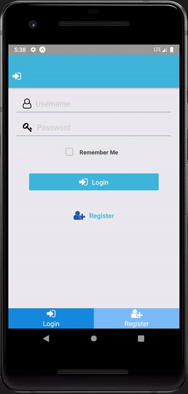

# React Native Application

## Overview

React Native Application for a campsite application that allows the user to search campsites, add campsites to their favorites, and read or add comments / reviews of campsites.

## Tech Used

This application was built using React Native along with various third-party libraries including:

- React-native-elements for additional components
- React-navigation for drawer, stack, and tab navigation
- Redux along with redux-thunk for state management
- redux-persist to persist data client side
- Json-Server to serve/host data
- react-native-animatable for animations to the UI
- react-native-swipeout for swipe button functionality

This application also takes advantage of many of the APIs available to the Expo SDK including:

- expo-permissions along with expo-image picker to request camera and camera roll permissions
- expo-secure-store to store user login info
- expo-mail-composer to link to user's email
- react-native-community/netinfo to retrieve network information

## Wireframe and Design

Here are some screenshots showing the UI and UX design

## Contact Me

If you have any questions, concerns, or comments please contact me at wandrew8@gmail.com. You can check out more of my work [here](http://www.andrewjohnweiss.com).
